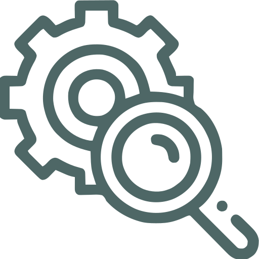

### Welcome to GeneMachine!

GeneMachine is a project built for the technical interview section for my application for a Software Engineer position at [BVARI (Boston VA Research Institute)](https://www.bvari.org/). It is built using TypeScript, React, Python, Flask, MySQL, Docker, a CursorAI development environment, and agentic development with Anthropic Claude models (Opus). 

You can spin the whole thing up with `docker-compose up -d --build` and spin it down with `docker-compose down -v`. 

GeneMachine is a search tool to link patients with genes and diagnosis-related organs. You can search by patient, gene, or diagnosis-related organ. 
